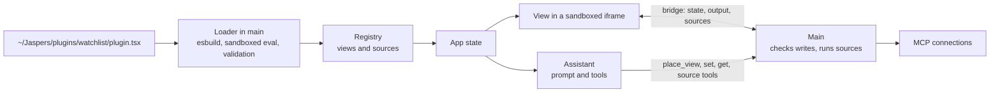

# How it works

Jaspers Terminal is an Electron app. The main process owns the state, runs the assistant, talks to MCP servers, and builds plugins. The window renders what main pushes to it and sends actions back. Plugins fill the grid.

## The app

- **One state tree, owned by main.** The Electron main process holds the app's state and is the only thing that writes it. After each change it pushes the whole tree to every window. The interface never edits state; it sends actions to main.
- **The assistant runs in main.** Each request calls the model with what is installed in its prompt, and the grid, the work on it, the focused element's state, the time, and the scheduled tasks alongside each turn. It runs the tools the model asks for and repeats until the model answers. The assistant in the box above the composer routes: it answers in words when words are the whole answer, arranges the grid, and for anything to be shown or kept it starts a piece of work or hands the request to the work it is about, and its part ends there with one line saying so. Before it starts a new piece of work it asks, saying what the work is and which plugins it uses, and makes nothing until you press Start; when it cannot tell whether a request is for the chat, for work that exists, or for new work, it asks which. A request starts as it is sent: you can send another while one is still working, and each runs beside the others with its own trail and its own Stop, which ends it, keeping what it had done so far. Requests in flight do not see each other's work until one has ended; each sees the grid as it is. A question from one of them waits its turn behind a question already on screen, and says which request it came from. A scheduled task's run never holds up yours. The chat keeps every exchange of a workspace's conversation, across restarts, and scrolling up reads back through it. The model is sent less: the last three exchanges and the new request, with what those exchanges' tools answered at length as notes it can read again. What it works from is scoped to workspace and model and restored across app sessions, and `/new` starts it over.
- **Every piece of work has a tile and an assistant of its own.** Each element on a window's grid but the docked chat is the tile of a piece of work, named in its bar, with a conversation of its own that is kept across restarts. The views the work shows are laid out inside the tile, under its command line, on cells of the tile's own, drawn fitted to what is there: one view fills the tile, and a dashboard of ten is still one tile, which moves, resizes, minimizes, and maximizes as one. A view inside is resized by hand by an edge it turns to another view, on the tile's own cells: it stops against its neighbor, as a tile of a window does, so one is made smaller before the one beside it is made larger. The sides it shares with the tile resize the tile. A line typed in the command line at the top of the tile goes to that work's own run of the assistant: it is told of its own tile first and of the plugins its work uses, learning of another when it needs one, changes only its own views, places a new view inside its tile, and asks its questions and answers in the box, under the line. The box is folded to the line by default: a small label in the tile's bar says how the loop stands, working with what it is doing now, done, failed, or asking, and pressing it opens the box under the line. In a tile with no view yet, a run opens the box itself, so what the work is doing is what the tile shows, and the first view to load folds it. Open, a deep research loop shows the whole conversation; any other shows only the steps and the reply of its last request: its conversation is kept, and never opened. What it found is said there, briefly unless it is a deep research loop: it has no note to put its own words on the grid in, and the views under the line are for what the plugins show. It is sent its whole conversation, not the last three exchanges: every word of it, with what earlier requests found as notes that say how to read it again, so a small request in a tile does not carry everything the work ever fetched. Nothing is dropped from the conversation that is kept. One run at a time: a message sent while the work is at it joins that run, read with what it was just doing, and one sent as the reply is being written starts the next. The label in a tile's bar is that mark too, while its work is working or asking. Its minimize button leaves the tile as its bar, where it stands, with the cells under it free for others; what it showed is kept, a question waits, and the same button or a double click on the bar brings it back where it was, or to the nearest free cells. The bar ends in a menu, which a minimized tile keeps: what may be done (stop what the work is doing, close the loop, or delete it, which ends it and forgets its conversation), then what the work's assistant was told of, with each connection and what it is doing, and the work's timeline. Work the assistant starts from the global box gets a tile at once, half a window unless the request says where, which shows what its own assistant is doing until that one's first view loads into it and folds the box. The box above the composer is one conversation for the workspace; it places no view itself, and a view placed by hand becomes a piece of work of its own, in a tile it fills. A message typed there that starts with a loop's name, `@loop_3`, goes straight to that loop, as if typed in its tile.
- **A piece of work is a loop, and loops are numbered.** Each is named by the number its workspace gave it when it was made, loop_1, loop_2, and so on, never by what it does; a number is never given twice, so a loop keeps it through closing and reopening. Its bar reads `loop_3 · what it is`, and that is how you name it to the assistant ("send this to loop_3", "@loop_3 use 30 days"). The cross on its bar closes it: its tile goes with every view in it and what it is doing stops, but the loop is kept, views and conversation. **Settings > View loops** opens the list of every loop of the workspace on screen, open and closed, the one changed last first, with when it was created, closed, and reopened. Reopen puts a closed loop back where it was, or on the nearest free cells, and its assistant carries on with the conversation; Delete forgets it for good. The assistant can close and reopen loops too when you ask.
- **Tasks run in main too.** One timer runs each task at its time: one tool call made directly, like refreshing a view, or a request to the assistant, whose reply joins the workspace's conversation. Work such a request starts stays within the task's limits: it is told it runs for a task, it asks for no key, a question it has to ask waits ten minutes and no longer, and it counts against the daily budget. The task's run lasts until that work is done, and what the task says is what the work said.
- **Connections** are MCP servers, over stdio or streamable HTTP. A plugin declares them in its `plugin.tsx`, or you add one in Settings and the app writes that plugin for you. Main keeps one client per connection. Keys, OAuth tokens, and the Jaspers sign-in's tokens never leave main; a server that signs its users in through Jaspers connects on that sign-in.
- **A server's own views.** An MCP server can ship a page for a tool's answer (MCP Apps). Main reads the page from the server and serves it on a scheme of its own, one origin per connection, with the policy the page declared. The built-in `core/app` view hosts it in a sandboxed iframe and passes what the page asks for to main, which checks each request against the panel it came from.
- **The store** is one SQLite file, `~/Jaspers/data/jaspers.db`. Every source run is recorded there with its arguments, its workspace, and the time, and the assistant reads it back with a read-only `query` tool. Each chat is kept there too, an exchange with what its run did and, when it failed, why. It runs in a process of its own, since SQLite is synchronous and main is what pushes state to the windows.
- **Plugins** are folders in `~/Jaspers/plugins/`, put there by hand or installed from Settings. Main builds each one, registers its views and sources, and renders its views in sandboxed iframes. A plugin with code of its own runs it in a separate process, reaching the app only through capabilities it declares. A plugin's view that is waiting on you, for a key the plugin declares or a sign-in to one of its connections, asks for it in its own element.
- **Skills** are folders with a `SKILL.md`, in `~/Jaspers/skills/` or a plugin's `skills/` folder, in the [Agent Skills](https://agentskills.io) format. The assistant's prompt lists each skill's name and description. When a request fits one, or the user types `/name`, the assistant loads that skill's instructions with a tool, and reads the skill's other files with another. A plugin's own model loads them the same way through its `skills` capability. See [Skills](skills.md).

## How a plugin connects to the app

A plugin adds views and data sources.

- A **view** is a React component that lives in a grid element. The assistant places it, changes what it shows by writing its state, and reads back what it shows.
- A **source** is a named data call, usually one tool on an MCP server. Views and the assistant both run sources.



1. **Discovery.** The app looks for folders with a `plugin.tsx` in `~/Jaspers/plugins/` (or `$JASPERS_HOME/plugins/`), whether you put it there or installed it. The folder name is the plugin id.
2. **Build.** Main bundles the folder with esbuild twice: once for the view's iframe, and once to read the definitions. Everything the plugin imports is bundled in, found in the plugin's own `node_modules`, except what the app provides: `react`, `react-dom`, `zod`, and `@jaspers-ai/sdk`.
3. **Definitions.** The definitions run once in a sandbox with no file system, no network, no Node globals, and a 2 second limit. React is a stub there, so components never run in main.
4. **Registration.** Main checks the definition, then registers its connections, sources, and views as `<plugin>/<name>`, like `watchlist/quotes`.
5. **What the assistant sees.** A piece of work's assistant is told each of its plugins' views with the state keys it takes, and each source with its connection's status; the one in the global box is told what each view is, and the sources. Either calls sources through `run_source { source, input }` and asks `describe_source` for a full input schema when needed. For the watchlist below:

   ```text
   - watchlist/watchlist: Watchlist. Renders watchlist/quotes. state: { tickers }
   - watchlist/quotes: Quotes for ticker symbols: name, price, and the day's change as a fraction. — takes tickers [connection watchlist/server: ready]
   ```

   A piece of work's assistant is told where its tile is, how the views inside it are laid out, and for each of them the view's `instructions`, state, and output. The one in the global box is told each tile with the views inside it, and which tile is focused.

6. **Placing and driving.** A piece of work's assistant calls `place_view { view: "watchlist/watchlist", state: { tickers: ["AAPL"] } }`, which puts the view inside its tile, changes the element with `set panels/e1/state/tickers ["MSFT"]`, and reads it with `get panels/e1/output`. Main checks every state write against the view's schema and rejects invalid ones with the reason.
7. **Rendering.** Each plugin view gets its own sandboxed iframe with no network and no reach into the app. A plugin can declare sites its views may show in a frame, as the TradingView chart does. The app supplies React, zod, and the SDK. The view talks to the app only through the SDK hooks, which pass messages to main.
8. **Sources run through main.** Main calls an MCP connection or delegates a function source to its plugin host, keeps the rows, and hands them to the view. Two runs with the same arguments within 60 seconds share one call. Keys never reach a plugin.
9. **Hot reload.** Saving any file in a plugin folder in `~/Jaspers/plugins` rebuilds the plugin and remounts its views, and each element keeps its state and output. A failed build keeps the last good version running and reports the error.

## Project layout

```
src/main/agent/    The assistant's loop and its helpers under utils/, the requests that run it, its threads and memory, the tool families under tools/, the plugin builder under build/, and the web under web/
src/main/llm/      Provider request protocols and stream readers
src/main/plugins/  Plugins, their hosts and capabilities, installs, connections
src/main/hub/      Jaspers Hub: the directory's listings, and publishing a plugin or skill of the user's own
src/main/          Main process: the state tree and its actions at the root, a folder per area beside them
src/preload/       The bridge between the interface and main
src/renderer/      Interface: React, TypeScript, Tailwind CSS v4
src/host-runtime/  What a plugin view's iframe loads: React, zod, the SDK
src/store/         The store process: the SQLite file every source run is kept in
src/shared/        Types and pure logic shared across processes, a folder per area
packages/sdk/      @jaspers-ai/sdk: what views and plugins are written against
scripts/           Build scripts: the plugin view runtime, the SDK package
electron-builder.yml  Packaging for `npm run dist`
```

Built with Electron and electron-vite. Contributor commands and rules live in [CLAUDE.md](../CLAUDE.md); implementation constraints are in [Development](development.md).

## Further reading

- [Connections and data](connections-and-data.md) covers adding a server, the built-in views, and the store.
- [Writing a plugin](writing-a-plugin.md) builds one from scratch.
- [SDK reference](sdk-reference.md) lists what `@jaspers-ai/sdk` exports.
